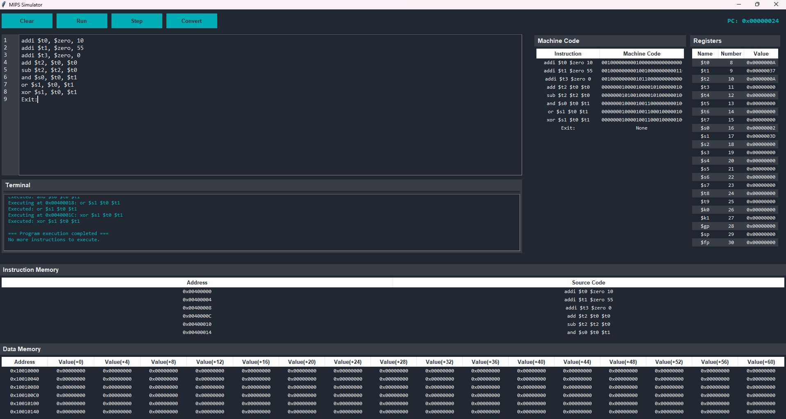

# MIPS Simulator IDE 🖥️📝

## Overview

This is a comprehensive MIPS Assembly Language Simulator built with Python and Tkinter, providing an interactive development environment for MIPS assembly programming. The simulator allows users to write, load, and execute MIPS assembly code with step-by-step execution and real-time register and memory tracking. It also includes machine code conversion capabilities.

## 🌟 Features

### Code Editor

- Line numbering with synchronized scrolling
- Basic text editing capabilities (undo, redo, etc.)
- Scrollable text area

### Execution Environment

- Step-by-step code execution
- Real-time program counter tracking
- Logging of executed instructions to a console
- Supports jumping, branching, and return from subroutine calls.

### Register and Memory Management

- Interactive register view with real-time updates
- Data memory view with address and 16 value columns
- Data segment visualization and updates

### Machine Code Conversion

- Converts MIPS assembly instructions to their binary machine code equivalents.
- Displays the results in a structured table alongside the original instruction.

### Supported Instructions

- **Arithmetic**: `add`, `sub`, `addi`
- **Logical**: `and`, `or`, `xor`, `andi`, `ori`
- **Shift**: `sll`, `srl`
- **Memory**: `lw`, `sw`
- **Comparison**: `slt`
- **Control Flow**: `beq`, `bne`, `j`, `jal`, `jr`, `li`
- **System**: `syscall`

## 📸 **User Interface Preview**



## 🚀 Installation

### Prerequisites

- Python 3.8+
- Tkinter (usually comes pre-installed with Python)

### Clone the Repository

```bash
git clone https://github.com/yourusername/mips-simulator.git
cd mips-simulator
```

### Dependencies

No external dependencies required beyond standard Python libraries.

## 📋 Usage

### Running the Simulator

```bash
python main.py
```

### Writing MIPS Code

1. Use the text editor to write your MIPS assembly code
2. Include `.data` and `.text` sections
3. Define labels for branching and jumping

### Example Code

```assembly
.data
    result: .word 0

.text
main:
    addi $t0, $zero, 5     # Load 5 into $t0
    addi $t1, $zero, 3     # Load 3 into $t1
    add $t2, $t0, $t1      # Add $t0 and $t1, store in $t2
    sw $t2, result         # Store result in memory
    li $v0, 10 # syscall exit
    syscall
```

## 🕹️ User Interface

The simulator's user interface is structured into several key areas:

### Left Panel: Code Editor
- Write and edit MIPS assembly code
- Line numbers for easy reference that scroll with text
- Supports undo/redo

### Left Panel: Bottom

-   **Terminal:** Displays execution logs, program counter updates, and step-by-step execution messages
-   **Instruction Memory:** Displays the address and source code of loaded instructions
-   **Data Memory:** Visualizes data segment memory with address and 16 columns for value tracking

### Right Panel: Registers

-   Shows register names, numbers, and current values in hex format.
-   Real-time updates during execution.

### Right Panel: Left

-   **Machine Code:** Displays MIPS code and its machine code representation

## 🛠️ Control Buttons

-   **Clear**: Clears the console, memory, and register values
-   **Run**: Loads the code sections, initializes the simulator, and resets PC
-   **Step**: Executes one instruction at a time
-   **Convert Machine Code:** Converts the loaded MIPS assembly code to its machine code equivalent and displays the output.

## 🚧 Limitations

- Basic memory simulation with limited size (512 bytes)
- Supports integer operations only
- Limited pseudo-instruction handling
- Address is word-aligned

## 📄 License

[MIT License](LICENSE)

## 🤝 Contributing

1. Fork the repository
2. Create your feature branch (`git checkout -b feature/AmazingFeature`)
3. Commit your changes (`git commit -m 'Add some AmazingFeature'`)
4. Push to the branch (`git push origin feature/AmazingFeature`)
5. Open a Pull Request

## 📧 Contact

Your Name - emremehmet32@hotmail.com | emremehmet2032@gmail.com

Project Link: [https://github.com/mehmetemrekayacan/MIPS_Simulator](https://github.com/mehmetemrekayacan/MIPS_Simulator)
